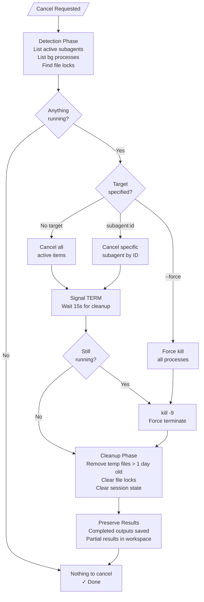
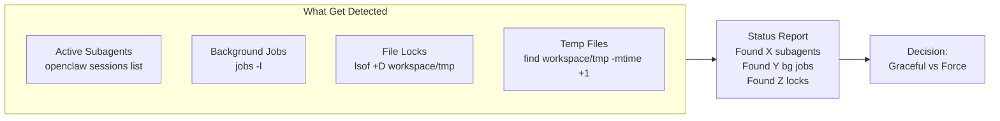

# Graceful Task Cancellation

> **Intelligent task lifecycle management for AI agents.** Cancel active tasks, subagents, and background processes with proper cleanup — partial results are preserved, temp files are cleared, and locks are released.

[](LICENSE)
[](package.json)

---

## Why This Exists

Killing a running agent task mid-execution is rarely clean. Subagents get orphaned, temp files accumulate, file locks block future operations, and partial results are lost. This skill provides a structured cancellation system that:

- **Detects** what's running (subagents, background processes, file locks)
- **Signals** gracefully with a cooldown period for cleanup
- **Force-kills** if the graceful approach times out
- **Cleans up** temp files, locks, and stale state
- **Preserves** completed outputs and partial results

No more zombie processes, no more "lock file already exists" errors, no more lost work.

---

## How It Works



---

## Cancellation Modes

### Graceful Cancel (Default)

```
/cancel
```

1. **Detect**: Scans for active subagents, background jobs, and file locks
2. **Signal**: Sends TERM signal to each, allowing graceful cleanup (15s timeout)
3. **Force after timeout**: If any process remains, sends KILL signal
4. **Cleanup**: Removes temp files older than 1 day, clears locks
5. **Preserve**: Completed outputs and partial results are left intact

Best for: routine task completion, switching between projects, freeing resources.

### Force Cancel

```
/cancel --force
```

Skips the graceful cooldown and immediately:
1. Kills all active subagents
2. Kills all background processes
3. Removes all temp files (regardless of age)
4. Clears all file locks
5. Resets session state

Best for: emergency stops, hung processes, complete workspace reset.

### Specific Subagent Cancel

```
/cancel subagent:4b34f12d
```

Targets a single subagent by ID while leaving others running. Useful for:
- A specific parallel task is misbehaving
- You want to stop one branch of work without disrupting others

### Full Reset

```
/cancel --all
```

Same as `--force` but additionally:
- Clears workspace state completely
- Removes all session artifacts
- Resets to clean state

---

## Detection



The system scans for four categories before deciding what action to take:

| Detection Target | Method | Graceful | Force |
|------------------|--------|----------|-------|
| Active subagents | `openclaw sessions list --active` | TERM + wait | KILL |
| Background jobs | `jobs -l` | TERM + wait | KILL |
| File locks | `lsof +D ~/.openclaw/workspace/tmp` | Release on process exit | `rm -f *.lock` |
| Temp files | `find ... -mtime +1` | Skip (under 1 day) | Delete all |

---

## State Preservation

Graceful cancellation is designed to preserve what matters and clean up what doesn't.

### Preserved
- ✅ Files already written to disk
- ✅ Completed subagent outputs
- ✅ Session logs
- ✅ Partial results in workspace/partial-results/

### Removed
- ❌ Running processes (killed)
- ❌ File locks (released)
- ❌ Active session state (cleared)
- ❌ Temp files over 1 day old (cleaned)

---

## When to Use

| Scenario | Command | Result |
|----------|---------|--------|
| Task completed naturally | `/cancel` | Clean exit, preserve results |
| Need to stop and fix a bug | `/cancel` | Stop gracefully, keep partial work |
| Process is hung / unresponsive | `/cancel --force` | Kill everything, cleanup |
| Starting a conflicting task | `/cancel` then new task | Safe handoff |
| Workspace is cluttered | `/cancel --all` | Complete reset |
| One subagent misbehaving | `/cancel subagent:<id>` | Targeted cleanup |

---

## Integration

### Session Lifecycle

For framework-provided task management, integrate cancellation into every workflow:

1. **Before starting a long task**: Note the current state (nothing should be running)
2. **During task execution**: Handle TERM signals gracefully — save partial progress
3. **After task completion**: Run cancellation to clean up any leftover processes
4. **On error**: Run cancellation with force flag to ensure clean state

### Cleanup Patterns

```bash
# Graceful flow
/cancel

# Force flow with verification
/cancel --force
jobs          # Verify nothing running
ls workspace/tmp  # Verify temp cleaned

# Before starting new project
/cancel --all
```

---

## Implementation

The skill is implemented as a lightweight bash script with minimal dependencies:

1. Parses arguments to determine mode (default, force, specific target)
2. Detects active subagents via framework CLI
3. Sends graceful TERM signals with configurable wait
4. Escalates to KILL if processes remain
5. Runs cleanup in order: locks → temp files → state

### Dependencies

- Standard POSIX tools (bash, grep, awk, kill, find, rm)
- `lsof` (optional, for enhanced lock detection)
- Framework CLI for subagent management

---

## Roadmap

- [ ] Configurable grace period per process type
- [ ] Pre-cancel hooks for custom cleanup routines
- [ ] Cancel history log for auditing
- [ ] Dry-run mode showing what would be cancelled
- [ ] Parallel cancellation of independent subagents

---

## License

MIT — See [LICENSE](LICENSE) for details.

Built by [nerudek](https://github.com/nerudek). If this saved you time or prevented data loss, [buy me a coffee](https://www.paypal.me/nerudek).
